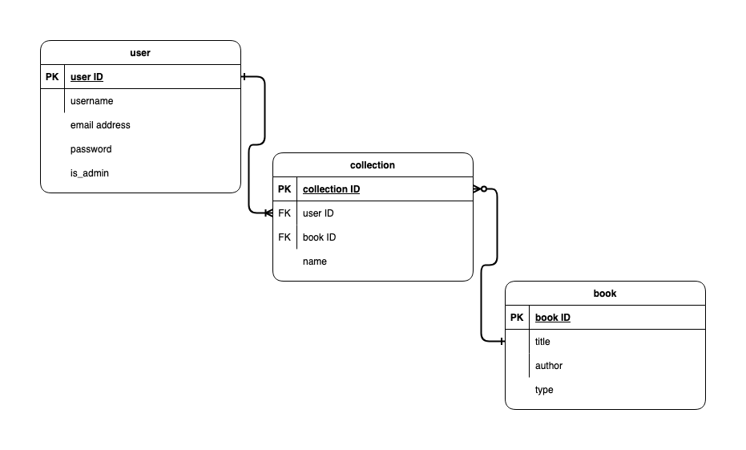
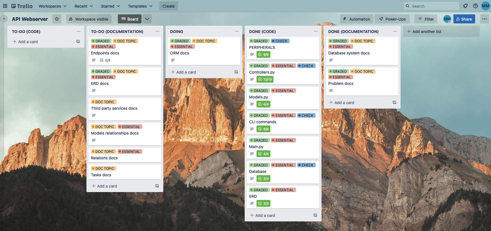

# API Webserver Project Documentation

## Links

[GITHUB](https://github.com/most-debwev/API-Webserver)

[TRELLO](https://trello.com/b/59rx9Nnd/api-webserver)

## The Problem

--------------

This project is an application that catalogues a library of books and allows the user to create lists within that library. While this application can certainly be used for a home library, despite their usual moderate size, it is intended to be used for libraries with a vast collection of books that are more difficult to group together based on individual and personalised lists (or collections).  

It is true that public, and often private library collections, have a searchable catalogue located on an on or offline network and that this application almost mirrors this, yet this application was developed to be used by individuals with an interest in the books of a certain library and who wish to have internet based access to the titles within this library. For example, within this library book collection a user may be able to make multiple lists in their account with different titles based on their different needs (a wishlist, gift ideas, read and unread etc). This gives the user a centralised location of a list of books that match their interests.

Oten a user must travel to their public library to view the titles of their collection, or navigate to their website to make use of lists. This application allows users to download one application on their device and access possibly thousands of titles from different libraries in their region and beyond.

## The Database

--------------

This project utilises a SQL relational database management system (postgreSQL) to manage the book, user and collections data. Although this type of database management system is highly efficient at storing and querying data stored within it, a drawback to this type of system is the difficulty in maintaining it as this becomes more difficult over time as the database grows to include a large amount of data - this can also be quite costly as it requires database management expertise.  
Another drawback to this type of system is the fact that this type of database only stores data in tabular form and this makes it difficult to store and represent data that have complex relationships - many applications therefore need multiple tables to represent all the data necessary for their application logic. This can impact the performance speed of the database when there is a high volume of data transactions with large amounts of queryable data.

## The ORM

--------------

This project has been developed with SQLAlchemy as the ORM (Object Relational Mapper). SQLAlchemy is a library that allows communication between programs written in Python and respective databases. SQLAlchemy takes Python classes and translates them into tables in the relational database, as well as converting function calls to SQL statements.  
As an ORM in this project, SQLAlchemy moved data between the objects and the database - for example data entered into the 'Users' class created an instance of a user profile in the user table in the database using a command written in Python in the commands module. Executing this, and other commands (such as the 'seed' command), changed the data (added, deleted, updated) in the database without using any SQL statements in the command line.  

## The Endpoints

--------------
The endpoints in this project are grouped within their relations and detailed as follows:

### User Endpoints

***route('/')***  
is a 'GET' endpoint that will list all of the registered users. If a user with admin privileges is logged in, the endpoint will list the details of all registered users. This includes all details: user id, username, email address, their hashed password and whether they are admin users or not.  
The endpoint requests the admin user logs in using their email address and password, authentication method is JWT bearer token.  

***route('/register')***  
is a 'POST' endpoint that allows a new user to register a user account. The data required to create the account is: username, email address and password. The email address entered must be unique or an IntegrityError will be raised with the message: 'Email address is already registered to an existing user, please enter a different email address'.  
If the user successfully creates a new account, the new username and email will be displayed. Authentication method is JWT bearer token.  

***route('/login')***  
is a 'POST' endpoint that allows registered users to login using their email address and password. Authentication method is JWT bearer token. If the user logs in successfully, a message will be displayed: 'Welcome, (username)' and the token will be returned. If the user enters an incorrect or invalid password, a message will be displayed: 'Invalid email or password'.  

***route('/change-user-details')***  
is a 'PUT', 'PATCH' endpoint that allows logged in users to change their details. The details that can be changed include their username, email and password. The user must be logged in using an unexpired JWT bearer token. If the user changes their details, their new username and email address will be returned, excluding their password.  

***route('/delete-user')***  
is a 'DELETE' endpoint that allows a logged in user to delete their account. The user must be logged in using an unexpired JWT bearer token. If the user deletes their account a message displayed: 'your account has been deleted'.  

### Collection Endpoints

***route('/')***  
is a 'GET' endpoint that will list all the collections for all users. The user must be logged in using an admin access token otherwise a message will be displayed: 'You must be an admin'. If the user is an admin user, the collection data dsiplayed will include the collection id, the user id and the collection name.  

***route('/create')***  
is a 'POST' endpoint that allows a logged in user to create a new collection - expected parameters include the book id, the user id and the new collection name. If the user creates a new collection successfully, a message will be displayed: 'This is your (collection name) collection.' along with the new collection details and their JWT bearer token.  

***route('/my-collections')***
is a 'GET' endpoint that will list the collections for the logged in user. The user must be logged in using their unexpired JWT bearer token.  

### Book Endpoints

***route('/')***
is a 'GET' endpoint that will list all books. The book details will include the title, author and type. Users may or may not be logged in to view this information.

***route('/<int:id>/')***
is a 'GET' endpoint that will list the details of one book. The book selected will display the details includind the title, the author and the type of book. Users do not need to be logged in to view this information. If an invalid book is selected, a message will be displayed: 'error': 'Book not found with (book id)'.

***route('/authors')***  
is a 'GET' endpoint that will return a list of all authors excluding their associated book information. Users do not need to be logged in to view this information.

***route('/add')***  
is a 'POST' endpoint that will allow a logged in user to add a book to the list. Users must be logged in with an unexpired JWT bearer token to add any book titles. The required parameters include the book title, the author, and the type. If the user has successfully added a book, a message will be displayed: 'You have added (new book title) by (new author)' along with the their JWT token.  

## The ERD, Models & Relations

--------------  
This is the Entity Relationship Diagram for the project with the normalised relations depicted and how they relate to each other.

### Models  

The models are defined as each relation in the ERD - the  User model, the Book model and the Collection model.

### Relations  

The relations are represented in tabular form in the database and have the following values and relationships to each other:  

*User relation* has the primary key User_ID, and the values username, email address, password and is_admin boolean. This relation has a one to many relationship with the Collection relation.  

*Collection relation* has the primary key Collection_ID, and the values user_ID, book_ID and name, with user_ID and book_ID both being foreign keys. This relation has a many to one relationship with the user relation and a zero to many relationship with the book relation.  

*Book relation* has the primary key book_ID and the values title, author and type. This relation has a one to many relationship with the collection relation.  

## Project Management

--------------

The project management software used in the development of this project was hosted on Trello.  

